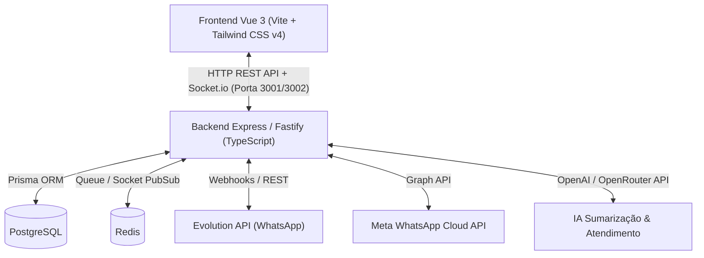

# Documentação Técnica Completa - Sistema Abravely (Versão Homologada)
**Data da Documentação:** 31 de Julho de 2026  
**Versão Alvo:** Estável de 29/07/2026 (Refinada até o início de 30/07)  
**Projeto:** Abravely - Chat Multicanal IA  
**Finalidade:** Guia completo de arquitetura, contratos de dados, endpoints, componentes de interface, prompts de IA e fluxos de atendimento para servir de manual técnico oficial de reimplementação e evolução.

---

## 📐 1. Arquitetura do Sistema e Stack Tecnológica

O **Abravely Chat Multicanal** é uma plataforma SaaS multitenant de atendimento omnichannel alimentada por Inteligência Artificial.



### Tecnologias Utilizadas:
- **Frontend**: Vue 3 (Composition API / `<script setup>`), Vite, Tailwind CSS v4, Lucide Icons, `@unhead/vue`, Socket.io-Client.
- **Backend**: Node.js, TypeScript, Express / Fastify, Prisma ORM, Socket.io, Redis (`ioredis`), BullMQ, `bcryptjs`, `jsonwebtoken`, `jszip`, `papaparse`.
- **Banco de Dados**: PostgreSQL com Prisma Client.

---

## 🗄️ 2. Especificação do Banco de Dados & Schemas (Prisma ORM)

O modelo de dados suporta controle multitenant por `Workspace`, perfis de usuário (`Role`), atendimentos (`Conversation`), histórico (`Message`), métricas de IA e base de conhecimento.

```prisma
datasource db {
  provider = "postgresql"
  url      = env("DATABASE_URL")
}

generator client {
  provider = "prisma-client-js"
}

enum Role {
  ADMIN
  AGENT
}

enum Plan {
  FREE
  PRO
  ENTERPRISE
}

enum FlowStatus {
  OPEN
  CLOSED
}

model Workspace {
  id               String   @id @default(uuid())
  name             String
  plan             Plan     @default(PRO)
  planExpiresAt    DateTime?
  maxUsers         Int      @default(5)
  maxChannels      Int      @default(2)
  aiFeatureEnabled Boolean  @default(true)
  adminNotes       String?
  createdAt        DateTime @default(now())
  updatedAt        DateTime @updatedAt

  users            User[]
  contacts         Contact[]
  conversations    Conversation[]
  cannedResponses  CannedResponse[]
  labels           Label[]
  channels         Channel[]
  helpArticles     HelpArticle[]
  executiveReports ExecutiveReport[]
}

model User {
  id              String       @id @default(uuid())
  name            String
  email           String       @unique
  password        String
  role            Role         @default(AGENT)
  avatarUrl       String?
  isPlatformAdmin Boolean      @default(false)
  workspaceId     String?
  workspace       Workspace?   @relation(fields: [workspaceId], references: [id])
  departmentId    String?
  department      Department?  @relation(fields: [departmentId], references: [id])
  createdAt       DateTime     @default(now())
  updatedAt       DateTime     @updatedAt

  conversations   Conversation[]
}

model Department {
  id          String   @id @default(uuid())
  name        String
  workspaceId String
  createdAt   DateTime @default(now())

  users         User[]
  conversations Conversation[]
}

model Contact {
  id          String   @id @default(uuid())
  name        String
  email       String?
  phone       String?
  company     String?
  avatarUrl   String?
  workspaceId String
  workspace   Workspace @relation(fields: [workspaceId], references: [id])
  createdAt   DateTime @default(now())

  conversations Conversation[]
}

model Conversation {
  id            String     @id @default(uuid())
  contactId     String
  contact       Contact    @relation(fields: [contactId], references: [id])
  agentId       String?
  agent         User?      @relation(fields: [agentId], references: [id])
  departmentId  String?
  department    Department? @relation(fields: [departmentId], references: [id])
  workspaceId   String
  workspace     Workspace  @relation(fields: [workspaceId], references: [id])
  flowStatus    FlowStatus @default(OPEN)
  closureReason String?
  aiSummary     String?
  lastMessage   String?
  unreadCount   Int        @default(0)
  createdAt     DateTime   @default(now())
  updatedAt     DateTime   @updatedAt

  messages Message[]
}

model Message {
  id             String       @id @default(uuid())
  conversationId String
  conversation   Conversation @relation(fields: [conversationId], references: [id])
  senderType     String       // 'USER' | 'AGENT' | 'SYSTEM' | 'AI'
  senderName     String?
  content        String
  mediaUrl       String?
  mediaType      String?      // 'image' | 'audio' | 'document' | 'video'
  fromMe         Boolean      @default(false)
  createdAt      DateTime     @default(now())
}

model CannedResponse {
  id          String   @id @default(uuid())
  shortcut    String   // Ex: /boasvindas
  content     String
  workspaceId String
  workspace   Workspace @relation(fields: [workspaceId], references: [id])
}

model Label {
  id          String   @id @default(uuid())
  name        String
  color       String
  workspaceId String
  workspace   Workspace @relation(fields: [workspaceId], references: [id])
}

model Channel {
  id          String   @id @default(uuid())
  name        String
  type        String   // 'EVOLUTION_WHATSAPP' | 'META_WHATSAPP' | 'WEBCHAT'
  status      String   // 'CONNECTED' | 'DISCONNECTED'
  qrcode      String?
  workspaceId String
  workspace   Workspace @relation(fields: [workspaceId], references: [id])
}

model HelpArticle {
  id          String   @id @default(uuid())
  title       String
  category    String
  content     String
  videoUrl    String?
  viewsCount  Int      @default(0)
  workspaceId String
  workspace   Workspace @relation(fields: [workspaceId], references: [id])
  createdAt   DateTime @default(now())
  updatedAt   DateTime @updatedAt
}

model ExecutiveReport {
  id          String   @id @default(uuid())
  title       String
  periodDays  Int      // 7, 14, 30
  isBusinessHours Boolean @default(false)
  summaryHtml String
  workspaceId String
  workspace   Workspace @relation(fields: [workspaceId], references: [id])
  createdAt   DateTime @default(now())
}
```

---

## 🖥️ 3. Módulos Funcionais e Especificação de Interface (Frontend)

A aplicação é dividida em 7 visões principais controladas pela variável reativa `currentView`:

### 1. Caixa de Entrada Multicanal (Inbox) (`currentView === 'conversas'`)
- **Abas da Caixa**: `Minhas` (atribuídas ao atendente logado), `Não Atribuídas`, `Todas`, `Participantes`, `Menções`.
- **Header de Atendimento**: Exibe foto do contato, nome, telefone, canal de origem (WhatsApp/Webchat) e indicador de status online/offline.
- **Plano de Fundo do Chat**: Estilizado com o wallpaper oficial do WhatsApp Dark Mode (`/whatsapp-wallpaper-dark.png`).
- **Caixa de Envio de Mensagens**:
  - Envio de mensagens de texto, suporte a emojis, atalhos de respostas rápidas acionados por `/`.
  - Gravação e envio de mensagens de áudio.
  - Anexo de imagens e documentos.
  - Indicador de digitação da IA ou do atendente no cabeçalho do chat.
- **Popover de Filtros Avançados**:
  - Filtro por Departamento, Atendente responsável, Canal/Conexão, Data de Início e Data de Fim.

### 2. Kanban de Atendimentos (`currentView === 'kanban'`)
- Visualização em colunas por estágio de fluxo (*Aberto*, *Em Atendimento*, *Aguardando Cliente*, *Resolvido*).
- Drag-and-drop de cards de atendimento entre colunas com atualização automática no banco de dados.

### 3. Gestão de Contatos (`currentView === 'contatos'`)
- Tabela responsiva com lista de contatos do workspace.
- Campos: Foto/Avatar, Nome, Telefone/WhatsApp, E-mail, Empresa e Ações (Editar, Excluir, Iniciar Conversa).

### 4. Relatórios Executivos & Atendimentos Finalizados (`currentView === 'relatorios'`)
- **Sub-aba 1: Atendimentos Finalizados**:
  - Tabela contendo todos os atendimentos encerrados.
  - Colunas: Cliente, Atendente (ou IA), Departamento, Motivo de Finalização e Assunto do Contato gerado por IA.
- **Sub-aba 2: Resumo Executivo IA**:
  - **Seletor de Período**: **7 dias**, **14 dias** e **30 dias**.
  - **Filtro de Horário Comercial**: Toggle para isolar métricas ocorridas durante a jornada de trabalho.
  - **Diagnóstico IA Consolidado**:
    - Distribuição dos assuntos mais recorrentes.
    - Tempo Médio de Atendimento (TMA) e Resolução.
    - Sugestões operacionais de melhoria para a gestão.
  - **Formatação Limpa**: Renderização em HTML formatado (`v-html`).
  - **Botão `Salvar Relatório Executivo`**: Salva o relatório com data e período para consulta posterior no histórico do gestor.

### 5. Central de Ajuda (`currentView === 'ajuda'`)
- Base de conhecimento interna para a equipe.
- Cadastro e edição pelo gestor de artigos textuais, com anexo de arquivos e vídeos explicativos.
- Busca inteligente por palavra-chave ou assunto.
- Contador automático de visualizações por artigo.

### 6. Simulador de WhatsApp (`currentView === 'simulador'`)
- Exclusivo para o perfil **Super Admin**.
- Permite selecionar qualquer Empresa/Workspace e a Instância conectada do WhatsApp para simular conversas em tempo real como se fosse um cliente externo.

### 7. Configurações Globais (`currentView === 'configuracoes'`)
Organizadas em 7 sub-abas:
1. **Perfil**: Nome, e-mail, foto, alteração de senha e botão de logout no footer.
2. **Departamentos & Equipes**: Cadastro de setores e associação de atendentes.
3. **Canais (Conexões)**: Integração com Evolution API, Meta WhatsApp Cloud API
4. **Respostas Rápidas**: Cadastro de atalhos acionados por `/`.
5. **Etiquetas (Tags)**: Gestão de marcadores coloridos.
6. **Inteligência Artificial**: Toggle para **Pausar / Ativar IA** globalmente, chave de API de IA e personalização dos prompts do robô.
7. **Mensagens de Automação & CSAT**: Saudações automáticas, mensagens de encerramento e pesquisa de satisfação.

---

## 🤖 4. Especificação dos Prompts e Lógica de IA

### A. Sumarização Automática de Atendimento Finalizado (`ai.service.ts`)
Quando um atendimento é encerrado (manualmente ou por IA), a IA lê todo o histórico da conversa e gera um resumo estruturado:

```typescript
const systemPrompt = `Você é uma IA analista de atendimentos. Analise a conversa a seguir e retorne um JSON com:
1. "subject": Assunto principal tratado (máximo 6 palavras).
2. "closureReason": Motivo do encerramento (ex: Dúvida Sanada, Venda Concluída, Suporte Técnico, Cancelamento).
3. "summary": Resumo conciso do atendimento em 2 parágrafos.
Retorne APENAS o JSON válido.`;
```

### B. Resumo Executivo Geral de IA (`report.service.ts`)
Para os relatórios periódicos (7, 14, 30 dias), a IA recebe o conjunto de resumos de atendimentos finalizados do período e gera a análise operacional:

```typescript
const promptExecutivo = `Você é um consultor executivo de operações de atendimento ao cliente.
Analise os resumos de atendimentos dos últimos ${periodDays} dias e gere um relatório estruturado em HTML com as seguintes seções:
<h2>📊 Distribuição de Assuntos Recorrentes</h2>
<p>Listagem formatada dos assuntos mais frequentes e suas porcentagens estimadas.</p>

<h2>⏱️ Desempenho e Tempo de Resposta</h2>
<p>Análise do tempo médio de atendimento e eficiência da equipe.</p>

<h2>💡 Sugestões de Melhoria Operacional</h2>
<ul>
  <li>Sugestões práticas para otimizar os fluxos e reduzir custos.</li>
</ul>

Formate a resposta em HTML limpo utilizando tags <h2>, <p>, <ul>, <li> e <strong>. Não inclua marcações em markdown como **asteriscos**.`;
```

---

## 📡 5. Catálogo de APIs REST e Eventos WebSocket

### A. Endpoints REST Principais (`backend/src/routes/api.routes.ts`)
- `POST /api/auth/login`: Autenticação e retorno de Token JWT e perfil do usuário.
- `GET /api/conversations`: Lista conversas do workspace com filtros de status e departamento.
- `POST /api/conversations/:id/close`: Encerra o atendimento gravando o motivo da finalização.
- `POST /api/conversations/:id/messages`: Envia mensagem no atendimento.
- `GET /api/reports/finished-conversations`: Retorna a lista de atendimentos encerrados com os motivos e assuntos gerados por IA.
- `GET /api/reports/executive-summary`: Gera o resumo executivo de IA com parâmetros `days=7|14|30` e `businessHours=true|false`.
- `POST /api/reports/executive-summary/save`: Persiste o relatório gerado no banco de dados.
- `GET /api/help/articles`: Retorna os artigos da Central de Ajuda.
- `POST /api/help/articles`: Cadastra ou edita um artigo de ajuda.

### B. Eventos WebSocket em Tempo Real (`backend/src/socket/socket.ts`)
- `connection`: Registra a conexão do cliente e associa à sala do `workspaceId`.
- `new_message`: Transmite mensagens recebidas ou enviadas para todos os atendentes conectados na sala do workspace.
- `typing`: Notifica que a IA ou o atendente está digitando.
- `presence`: Atualiza o status online/offline dos atendentes.

---

## 🔐 6. Credenciais de Testes e Perfis de Acesso

- **Gestor / Administrador Principal**:
  - E-mail: `guilherme@abravely.com` (ou `gestor@teste.com`)
  - Perfil: Administrador (Super Admin)
  - Botão de Acesso Rápido na tela de login: **`Entrar como Gestor`**

- **Empresa / Usuário de Testes (Pizzaria Bella Napoli)**:
  - E-mail: `gestor@bellanapoli.com`
  - Senha: `senha_bella_123`

---
*Manual técnico de especificação gerado e salvo em DOCUMENTACAO_VERSAO_HOMOLOGADA.md.*
