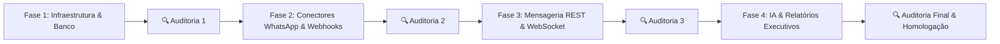

# 🚀 Plano de Execução do Backend & Auditoria de Fases (Abravely Chat 1.0)

Este documento orienta todo o desenvolvimento do Backend do **Abravely Chat 1.0 (Versão Comercial SaaS Multitenant)**. 
Cada fase possui metas claras, entregáveis técnicos e um **Checklist de Auditoria Obrigatória** que deve ser validado com 0 erros antes de avançar para a próxima fase.

---

## 📅 Visão Geral das Fases

---

## 🔹 FASE 1 — Infraestrutura, Docker & Banco de Dados Multitenant
**Objetivo:** Configurar o ambiente do servidor `backend/`, subir a pilha Docker e criar o modelo relacional de dados com Prisma ORM.

### 📦 Entregáveis Técnicos:
- [x] Estrutura física da pasta `backend/` (`package.json`, `tsconfig.json`, `src/`).
- [x] Arquivo `docker-compose.yml` contendo:
  - **PostgreSQL 15** (Porta `5432`).
  - **Redis 7** (Porta `6379`).
  - **Evolution API (Go)** (Porta `8080` com variáveis de ambiente configuradas).
- [x] Arquivo `backend/prisma/schema.prisma` com os modelos:
  - `Workspace` (Locatário SaaS)
  - `User` (Administradores e Atendentes)
  - `Channel` (Conexões Evolution GO e Meta Cloud API)
  - `Contact` (Clientes/Contatos)
  - `Conversation` (Atendimentos abertos e encerrados)
  - `Message` (Histórico de mensagens de texto, áudio e mídias)
  - `ActivityLog` (Auditoria e Histórico de ações da conversa)
  - `CannedResponse` (Respostas rápidas)
  - `HelpArticle` (Artigos da Central de Ajuda)
  - `SavedExecutiveSummary` (Relatórios salvos de IA)
- [x] Seed inicial de dados (`npm run seed`) para criar Workspace e Administrador Padrão.

---

## 🔹 FASE 2 — Conectores Reais de WhatsApp & Normalização de Webhooks
**Objetivo:** Estabelecer a comunicação real com a Evolution API GO e WhatsApp Meta Cloud API Oficial, e receber webhooks em tempo real.

### 📦 Entregáveis Técnicos:
- [x] **Service Evolution API (`evolution.service.ts`):**
  - Requisição REST para criar instância no container Docker.
  - Endpoint de geração de QR Code base64 em tempo real.
  - Disparo de mensagens de texto, imagens e áudio PTT.
- [x] **Service Meta Cloud API (`meta.service.ts`):**
  - Envio de mensagens oficiais utilizando Token Permanente e Phone Number ID.
- [x] **Rotas de Webhook (`webhook.routes.ts`):**
  - Rota `POST /api/v1/webhooks/evolution/:instanceName` para receber mensagens e status de envio.
  - Rota `POST /api/v1/webhooks/whatsapp/meta` com validação de token de handshake.
  - Normalizador Universal de Payloads: Converte JSONs heterogêneos em registros de `Message` e `Conversation` no PostgreSQL.

---

## 🔹 FASE 3 — Motor de Mensageria REST & WebSocket em Tempo Real (Socket.io)
**Objetivo:** Conectar o Front-End Vue 3 ao Backend via REST APIs e WebSockets para mensageria instantânea sem necessidade de atualizar a página.

### 📦 Entregáveis Técnicos:
- [x] Servidor HTTP + Adaptador Socket.io (`server.ts`).
- [x] Eventos Socket.io: `message:new`, `conversation:update`, `agent:status`.
- [x] Controller de Conversas (`conversation.routes.ts`):
  - Listar conversas abertas / atribuídas / encerradas.
  - Assumir conversa, transferir atendente/departamento, reabrir conversa.
  - Enviar mensagem (Texto, Áudio, Anexos, Notas Privadas).

---

## 🔹 FASE 4 — Inteligência Artificial, Relatórios & Central de Ajuda
**Objetivo:** Implementar os motores de IA para resumos individuais/globais e integrar a Central de Ajuda.

### 📦 Entregáveis Técnicos:
- [x] **Service de Inteligência Artificial (`ai.service.ts`):**
  - Integração com OpenAI / OpenRouter.
  - Sumarização automática ao finalizar conversa.
- [x] **Service de Relatórios (`report.service.ts`):**
  - Compilação dos relatórios executivos de 7, 14 ou 30 dias.
  - Filtro por horário comercial.
  - CRUD de Relatórios Salvos.
- [x] **APIs da Central de Ajuda:**
  - Criar, editar, excluir e contar visualizações de artigos de suporte.

---

## 🛡️ Regras de Auditoria & Validação entre Fases
Ao término de **CADA FASE**, será executada uma auditoria rigorosa cobrindo:
1. **Compilação Zerada:** `npx tsc --noEmit` sem nenhum erro.
2. **Estabilidade de Execução:** Verificação de logs e tratamento de exceções (try/catch / conexões do banco).
3. **Teste de Carga & Validação Integrada:** Teste dos endpoints com requisições reais HTTP/JSON.
